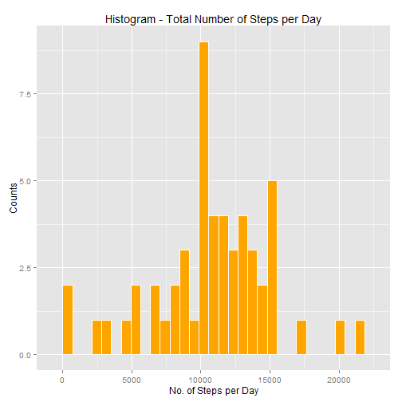
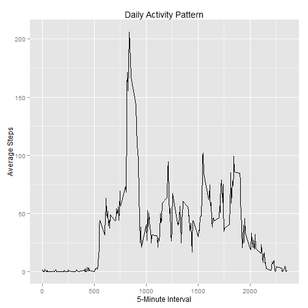
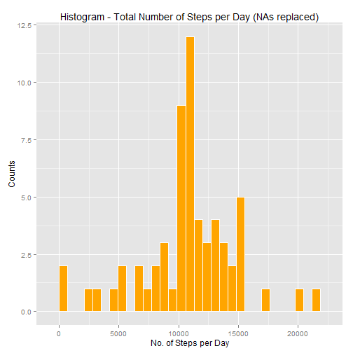
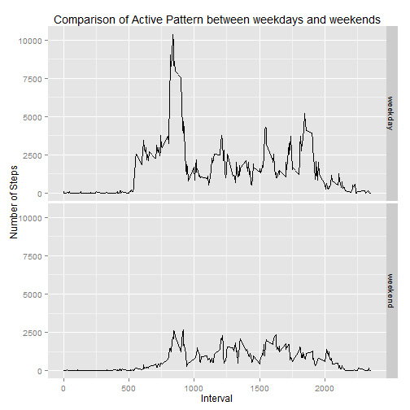

# Peer Assessment 1
1/17/2015, Reproducible Research

## 1. Loading and Preprocessing the Data
Load the dataset, then take a glance at the structure and its first 10 observations.

```r
activity <- read.csv("activity.csv", stringsAsFactors = F)
str(activity)
```

```
## 'data.frame':	17568 obs. of  3 variables:
##  $ steps   : int  NA NA NA NA NA NA NA NA NA NA ...
##  $ date    : chr  "2012-10-01" "2012-10-01" "2012-10-01" "2012-10-01" ...
##  $ interval: int  0 5 10 15 20 25 30 35 40 45 ...
```

```r
head(activity, 10)
```

```
##    steps       date interval
## 1     NA 2012-10-01        0
## 2     NA 2012-10-01        5
## 3     NA 2012-10-01       10
## 4     NA 2012-10-01       15
## 5     NA 2012-10-01       20
## 6     NA 2012-10-01       25
## 7     NA 2012-10-01       30
## 8     NA 2012-10-01       35
## 9     NA 2012-10-01       40
## 10    NA 2012-10-01       45
```

To facilitate the following operations, turn the dataset to data frame tbl.

```r
if(!"dplyr" %in% installed.packages())install.packages("dplyr")
require(dplyr)
activity <- tbl_df(activity)
activity
```

```
## Source: local data frame [17,568 x 3]
## 
##    steps       date interval
## 1     NA 2012-10-01        0
## 2     NA 2012-10-01        5
## 3     NA 2012-10-01       10
## 4     NA 2012-10-01       15
## 5     NA 2012-10-01       20
## 6     NA 2012-10-01       25
## 7     NA 2012-10-01       30
## 8     NA 2012-10-01       35
## 9     NA 2012-10-01       40
## 10    NA 2012-10-01       45
## ..   ...        ...      ...
```

## 2. Total Number of steps Taken per Day
### 2.1 Histogram of Total Steps per Day

```r
# compute the no. of steps per day ignoring the missing values
no.steps <- activity[complete.cases(activity),] %>%
    group_by(date)                              %>%
    summarize(steps = sum(steps))
# take a look of no.steps
head(no.steps)
```

```
## Source: local data frame [6 x 2]
## 
##         date steps
## 1 2012-10-02   126
## 2 2012-10-03 11352
## 3 2012-10-04 12116
## 4 2012-10-05 13294
## 5 2012-10-06 15420
## 6 2012-10-07 11015
```

```r
# histogram of no.steps
if(!"ggplot2" %in% installed.packages())install.packages("ggplot2")
require(ggplot2)
ggplot(no.steps, aes(steps))                             +
    geom_bar(fill = "orange", color = "white")           +
    ggtitle("Histogram - Total Number of Steps per Day") +
    xlab("No. of Steps per Day")                         +
    ylab("Counts")
```

```
## stat_bin: binwidth defaulted to range/30. Use 'binwidth = x' to adjust this.
```

 

In general, this person often walked 10~15 thousand steps per day.

### 2.2 Mean and Median of Total Steps per Day

```r
# mean
mean(no.steps$steps)
```

```
## [1] 10766.19
```

```r
# median
median(no.steps$steps)
```

```
## [1] 10765
```
On average, he/she walked 10766 steps per day, and the median number is quite similar as the mean value: 10765.

## 3 Average Daily Activity Pattern
### 3.1 Time Series Plot
Need to firstly figure out the daily pattern:

```r
daily.pattern <- activity[complete.cases(activity),] %>%
    group_by(interval)                               %>%
    summarize(avg.steps = mean(steps))
# let's take a look
head(daily.pattern)
```

```
## Source: local data frame [6 x 2]
## 
##   interval avg.steps
## 1        0 1.7169811
## 2        5 0.3396226
## 3       10 0.1320755
## 4       15 0.1509434
## 5       20 0.0754717
## 6       25 2.0943396
```

```r
ggplot(daily.pattern)                                 +
    geom_line(aes(interval, avg.steps))               +
    ggtitle("Daily Activity Pattern")                 +
    xlab("5-Minute Interval")                         +
    ylab("Average Steps")
```

 

His/Her most active period in a day is at around 7:30 - 10:00 a.m. It's the exact time to go to work. And other peaks appears at around the meal or off-work time.

### 3.2 Maximum Average Number of Steps

```r
max.steps <- max(daily.pattern$avg.steps)
max.steps
```

```
## [1] 206.1698
```

```r
active.interval <- daily.pattern$interval[which(daily.pattern$avg.steps == max(daily.pattern$avg.steps))]
active.interval
```

```
## [1] 835
```
So the most active interval is at 8:35 - 8:40 a.m. when he/she walked on average 206 steps every day.

## 4 Imputing Missing Values
### 4.1 Counting NAs

```r
# count the number of observations which are not complete cases
no.na <- sum(!complete.cases(activity))
no.na
```

```
## [1] 2304
```
There are totally 2304 observations containing missing value.

### 4.2-4.3 Replace NAs by Average Daily Activity Pattern
It's better to use the average number of steps taken across all the 5-minute intervals to replace those NAs.

```r
no.days <- nrow(activity)/nrow(daily.pattern)
no.days
```

```
## [1] 61
```

```r
# the raw data contains walking info of 61 days

# combine activity and daily.pattern by matching every interval
df <- data.frame(activity, avg.steps = rep(daily.pattern$avg.steps,no.days))
for (i in 1:nrow(df)){
    if (is.na(df[i, 1])) df[i, 1] <- df[i, 4]
}
# remove avg.steps from df and save as newdf
newdf <- tbl_df(df[,1:3])   
# check newdf
newdf
```

```
## Source: local data frame [17,568 x 3]
## 
##        steps       date interval
## 1  1.7169811 2012-10-01        0
## 2  0.3396226 2012-10-01        5
## 3  0.1320755 2012-10-01       10
## 4  0.1509434 2012-10-01       15
## 5  0.0754717 2012-10-01       20
## 6  2.0943396 2012-10-01       25
## 7  0.5283019 2012-10-01       30
## 8  0.8679245 2012-10-01       35
## 9  0.0000000 2012-10-01       40
## 10 1.4716981 2012-10-01       45
## ..       ...        ...      ...
```
We can see that all NAs are replaced by the average steps of corresponding intervals.

### 4.4 Histogram of Total Steps per Day (NAs replaced)
The histogram of total steps per day with NAs replaced by average steps of interval:

```r
# compute the no. of steps per day replacing the missing values
no.steps.post <- newdf                          %>%
    group_by(date)                              %>%
    summarize(steps = sum(steps))
# take a look of no.steps
head(no.steps.post)
```

```
## Source: local data frame [6 x 2]
## 
##         date    steps
## 1 2012-10-01 10766.19
## 2 2012-10-02   126.00
## 3 2012-10-03 11352.00
## 4 2012-10-04 12116.00
## 5 2012-10-05 13294.00
## 6 2012-10-06 15420.00
```

```r
# histogram of no.steps.post
ggplot(no.steps.post, aes(steps))                                       +
    geom_bar(fill = "orange", color = "white")                          +
    ggtitle("Histogram - Total Number of Steps per Day (NAs replaced)") +
    xlab("No. of Steps per Day")                                        +
    ylab("Counts")
```

```
## stat_bin: binwidth defaulted to range/30. Use 'binwidth = x' to adjust this.
```

 

We can also check the mean & median of this dataset:

```r
# mean
mean(no.steps.post$steps)
```

```
## [1] 10766.19
```

```r
# median
median(no.steps.post$steps)
```

```
## [1] 10766.19
```
On average, he/she walked 10766 steps per day, and the median number is the same.

## 5 Difference in Activity Patterns between Weekdays and Weekends
### 5.1 Creation of factor variable indicating weekdays and weekends
We have to change the data type of variable date before telling weekdays:

```r
if(!"lubridate" %in% installed.packages())install.packages("lubridate")
require(lubridate)
newdf <- mutate(newdf, date = ymd(date))
# we can check the class of modified date
class(newdf$date)
```

```
## [1] "POSIXct" "POSIXt"
```

```r
# then, assign a new factor variable indicating the weekday and weekend
# using wday(){lubridate} instead of weekdays()
weekdays <- wday(newdf$date)  # 1 = "Sun"
weekdays[weekdays %in% 2:6] <- "weekday"
weekdays[weekdays %in% c(1,7)] <- "weekend"
pat.compare <- tbl_df(cbind(newdf, weekdays = as.factor(weekdays)))
pat.compare
```

```
## Source: local data frame [17,568 x 4]
## 
##        steps       date interval weekdays
## 1  1.7169811 2012-10-01        0  weekday
## 2  0.3396226 2012-10-01        5  weekday
## 3  0.1320755 2012-10-01       10  weekday
## 4  0.1509434 2012-10-01       15  weekday
## 5  0.0754717 2012-10-01       20  weekday
## 6  2.0943396 2012-10-01       25  weekday
## 7  0.5283019 2012-10-01       30  weekday
## 8  0.8679245 2012-10-01       35  weekday
## 9  0.0000000 2012-10-01       40  weekday
## 10 1.4716981 2012-10-01       45  weekday
## ..       ...        ...      ...      ...
```
### 5.2 Time Series Plots in Panel
Now let's compare the active pattern between weekdays and weekends

```r
avg.steps.weekdays <- pat.compare                             %>%
    group_by(weekdays, interval)                              %>%
    summarize(total.steps = sum(steps))                      
    
    
ggplot(avg.steps.weekdays, aes(interval, total.steps))                    +
    geom_line()                                                           +
    facet_grid(weekdays ~.)                                               +
    ggtitle("Comparison of Active Pattern between weekdays and weekends") +
    xlab("Interval")                                                      +
    ylab("Number of Steps")
```

 

The comparison of 2 plots apparently proves that he/she walked much less during weekends than weekdays.
